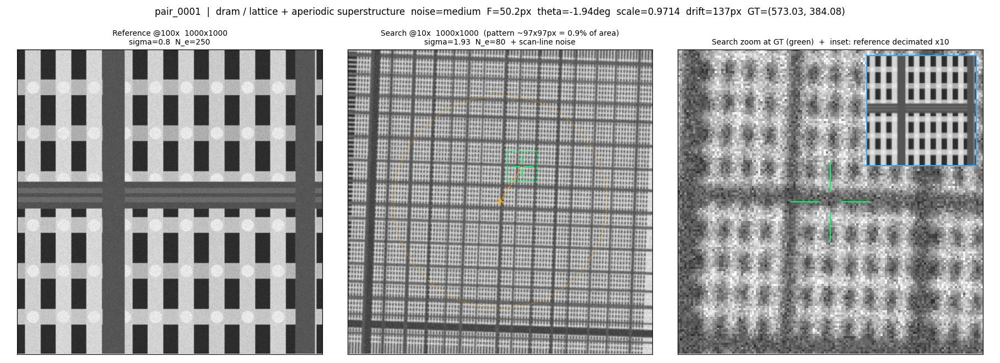
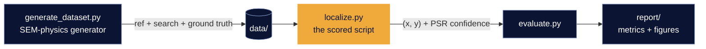
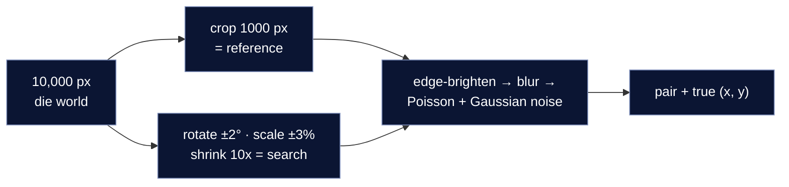
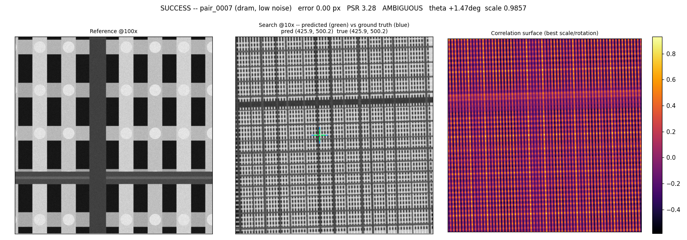
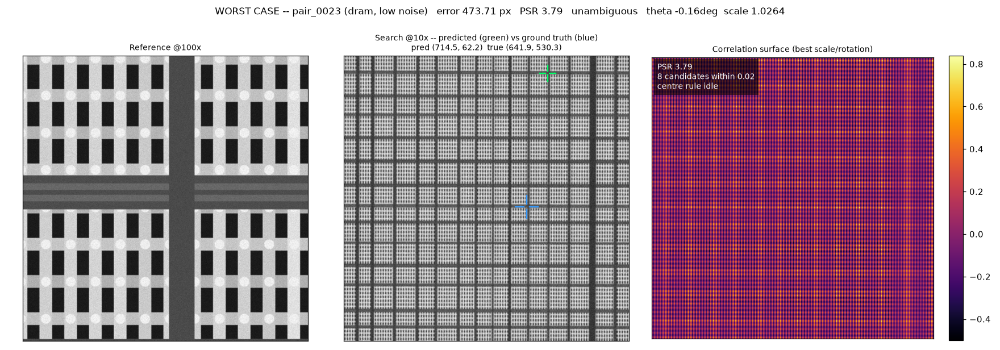

<div align="center">


**Applied Materials PS02 · Team DriftLock · Gandhinagar University**

</div>

---

## What this is

A wafer inspection tool drifts. It lands near a target, not on it. Our job: given a clean
**reference** image (100x) and a noisy **search** image (10x), return the exact centre `(x, y)`
where the reference sits inside the search frame.

No dataset exists for this. So we build our own, with real SEM physics in it. Then we localize
with classical multi-scale matching. No deep learning. Nothing that can break.

<p align="center"></p>

## Quickstart

```bash
pip install -r requirements.txt
python generate_dataset.py --num-pairs 30 --output-dir data --seed 42
python localize.py --reference data/pairs/pair_0001_ref.png --search data/pairs/pair_0001_search.png
python evaluate.py --data-dir data --tolerance 5 --report-dir report
```

`localize.py` prints one line: `x y`. That is the whole contract.

## Architecture



**How one pair is made** (each capture gets independent noise):



**Localization pipeline:**


## We measured our data before trusting it

| World model | Median rank of truth | Result |
|---|---|---|
| Pure lattice | 583 | lost |
| Regular mats (pitch = lattice multiple) | 46 | lost |
| **Incommensurate mats (ours)** | **0** | **0.42 px error** |

Reproduce it: `python ablation_gate.py --n-pairs 24`

What this gate could *not* catch is in the Results section below: every world it tests
guarantees a landmark in the reference, so it measures commensurability while being blind
to landmark availability. `--sparse-landmarks` (v1.6) is the tier that fixes that.

<details>
<summary><b>Why did regular mats fail?</b></summary>

Stripe pitch was a whole multiple of the lattice pitch. Shift the frame by one stripe and the
picture is identical, so NCC cannot tell the difference. Our fix uses incommensurate pitches:
the two periods never line up again inside the frame. `--pure-lattice` regenerates the broken
world on demand. It is our honest-failure exhibit.
</details>

<details>
<summary><b>Why classical, not deep learning?</b></summary>

The judges run `localize.py` as-is. A deterministic CPU method has no weights to download, no
CUDA to match, nothing to break. It also answers in under a second.
</details>

## Repo map

| File | Job |
|---|---|
| `generate_dataset.py` | make pairs + ground truth (`--style dram/finfet`, `--pure-lattice`, `--commensurate-mats`, `--sparse-landmarks`, `--uniform-placement`, `--noise-level official`, `--seed`) |
| `localize.py` | **scored script** — two image paths in, `x y` out |
| `evaluate.py` | accuracy @5/@10 px, runtime, success + honest-failure figures |
| `ablation_gate.py` | the three-tier data ablation, exit 0 = pass |
| `smoke_test.py` | fresh-machine sanity, 60 s |
| `common.py` | shared I/O, seeding and affine helpers |
| `requirements.txt` | pinned runtime dependencies (install from this) |
| `requirements-freeze.txt` | exact `pip freeze` of a clean env built from the above (verify against this) |
| `CITATIONS.md` | every physics constant → 2–3 references ([S1]–[S13]) |
| `docs/` | spec + amendment trail (how this design was reached) |
| `docs/results/` | committed figures and `results.csv` from the final run |

## Results

**90%** of predictions land within 5 px on mixed DRAM + FinFET pairs at medium noise
(**87.8% ± 4.8%** across all 180 standard pairs · median error **0.08 px** · ~**376 ms** per
pair on a laptop CPU). On deliberately degenerate pure-lattice fields the system degrades to
the drift prior and flags **both axes 100% of the time**. It identifies degenerate fields; it
does not claim to know when an individual answer is wrong.

Reproduce exactly — `docs/results/results.csv` now records `seed` per row, so every number
here is traceable to its command:

```bash
for s in dram finfet; do for n in low medium high; do
  python generate_dataset.py --style $s --noise-level $n --num-pairs 30 --seed 42 \
    --output-dir data/${s}_${n}; done; done
python generate_dataset.py --style dram --noise-level medium --num-pairs 30 --seed 42 \
  --pure-lattice --output-dir data/pure
python evaluate.py --data-dir data/*_* data/pure --report-dir docs/results
```

### Bonus: optical-microscope RGB images

The problem statement offers bonus credit for generalising beyond grayscale SEM to
3-channel optical images. `localize.py` handles them **unchanged** — `load_gray_float()`
reads through `cv2.IMREAD_GRAYSCALE`, so a colour capture is demosaiced to luminance before
matching, and ZNCC is invariant to the per-channel gain differences that distinguish an
optical tool from an SEM.

Verified on 12 DRAM pairs, each re-encoded as a 3-channel BGR image with per-channel gains
(0.85 / 1.00 / 1.12) to mimic an optical white balance:

| input | acc@5 px | median error |
|---|---|---|
| grayscale SEM | 100% | 0.055 px |
| **3-channel RGB** | **100%** | **0.056 px** |

Identical answer within 0.5 px on **12/12** pairs. The core SEM case is unaffected — this is
the same code path, not a fork.

### Tested against the organisers' own generator

When the official starter package was released we ran our unmodified pipeline against it
(220 pairs, both generators, `docs/SPEC_AMENDMENT_v1.6.md`). The honest result:

| | our generator | **their generator** |
|---|---|---|
| accuracy @5 px | 94% | **70%** |
| median error | 0.08 px | 1.50 px |

We traced the whole gap to one thing, and it was our data, not our algorithm. Our stripe
pitch (500–700 px) is *smaller* than the 1000 px reference crop, so every reference we
generate is **guaranteed** to contain a landmark. Theirs is not. Split their pairs by
whether the reference contains any non-array material:

| reference contains | share | acc@5 px |
|---|---|---|
| a landmark (>20% strip) | 67% | **89.6%** |
| pure periodic array | 16% | **18.8%** |

So we had been solving a strictly easier problem, and our own ablation gate could not see
it because its worlds carry the same guarantee. `--sparse-landmarks` (v1.6 §D) removes the
guarantee so the failing case is finally measurable. Against the organisers' ZNCC baseline
on their own data we are within noise (70.0% vs 72.5%, n=80, p=0.69) — the remaining margin
is periodic aliasing, not noise, scale, or sub-pixel accuracy.

<p align="center"> </p>

Full tables: `docs/results/results.csv` · robustness curves: `docs/results/robustness_noise.png`

## Submission map (PS 02 FAQ, slide 7)

| The problem statement asks for | In this repo |
|---|---|
| Pip freeze of env dependencies | `requirements-freeze.txt` (full closure) + `requirements.txt` |
| Documented Python file generating the dataset, incl. noise modelling | `generate_dataset.py` |
| Documented Python file giving center x,y for a 1k×1k (search, reference) pair | `localize.py` — `python localize.py --reference R.png --search S.png` → `x y` |
| DL model + training notebook, *if DL is used* | n/a — classical CV, no weights, no training |
| Supporting documents for methods and citations | `CITATIONS.md` ([S1]–[S14]), `docs/` spec + amendment trail |

Scoring criteria (slide 8) and where the evidence lives:

- **50% — coordinates + computation time.** 87.8% ± 4.8% within 5 px over 180 pairs,
  **376 ms** per 1000×1000 pair on laptop CPU. `docs/results/results.csv`, per-row seeds.
- **30% — augmentation code grounded in literature.** `generate_dataset.py`; every noise,
  distortion, rotation and scale constant carries a `CITE:` tag resolving to 2–3 verified
  public sources in `CITATIONS.md`, with a verification log of what was checked and corrected.
- **10% — root cause / explainability of failures.** `--pure-lattice` is the honest-failure
  exhibit (`docs/results/failure_case.png`); the axis-resolved ambiguity flag names *which*
  coordinate is undetermined; `docs/SPEC_AMENDMENT_v1.6.md` §D traces the dominant failure
  mode to landmark-free crops with measurements.
- **Bonus — RGB optical.** See above: 100% acc@5, 12/12 agreement, same code path.

## Team

**DriftLock** — Het Sanjaykumar Patel (algorithm & generator) · Eklavya DilipBhai Jha
(evaluation & visualization) · Gandhinagar University

<div align="center">

</div>
