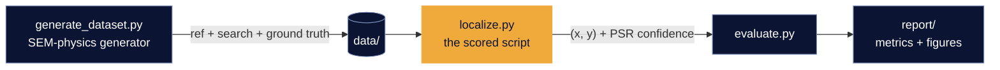
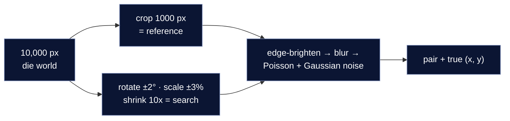

<div align="center">


**Applied Materials PS02 · Team DriftLock · Gandhinagar University**

</div>

---

## What this is

A wafer inspection tool drifts. It lands near a target, not on it. Our job: given a clean
**reference** image (100x) and a noisy **search** image (10x), return the exact centre `(x, y)`
where the reference sits inside the search frame.

No dataset exists for this. So we build our own, with real SEM physics in it. Then we localize
with classical multi-scale matching. No deep learning. Nothing that can break.

<p align="center"></p>

## Quickstart

```bash
pip install -r requirements.txt
python generate_dataset.py --num-pairs 30 --output-dir data --seed 42
python localize.py --reference data/pairs/pair_0001_ref.png --search data/pairs/pair_0001_search.png
python evaluate.py --data-dir data --tolerance 5 --report-dir report
```

`localize.py` prints one line: `x y`. That is the whole contract.

> **Build status.** Phase 1 (generator + data ablation gate) is complete and reproducible today.
> `localize.py`, `evaluate.py`, `smoke_test.py` and `requirements.txt` land in Phases 2–5 — until
> then only the `generate_dataset.py` and `ablation_gate.py` commands on this page run.

## Architecture



**How one pair is made** (each capture gets independent noise):



**Localization pipeline:**


## We measured our data before trusting it

A generator can quietly produce a dataset nobody can solve. So the world model was chosen by
ablation, not by assumption — each tier below is a flag that still ships, and the numbers are
what `ablation_gate.py` prints (n=24 pairs per row, plain single-scale NCC, no centre tie-break).

| World model | Flag | Median rank of truth | Result |
|---|---|---|---|
| Pure lattice | `--pure-lattice` | 583 | lost |
| Regular mats, pitch = lattice multiple | `--commensurate-mats` | 30 | lost |
| **Incommensurate mats (ours)** | *default* | **0** | **0.42 px median error** |

Reproduce it: `python ablation_gate.py --n-pairs 24`

<details>
<summary><b>Why did regular mats fail?</b></summary>

Stripe pitch was a whole multiple of the lattice pitch. Shift the frame by one stripe and the
picture is identical, so NCC cannot tell the difference. The diagnostic makes it visible: every
false peak lands on an exact integer multiple of *both* pitches at once — `SA_base/WL_pitch = 4.0`,
false peaks at `dx/DR = 4.00` and `dx/BL = 23.98 ≈ 4×6`.

Our fix uses incommensurate pitches: the two periods never line up again inside the frame (the
same pairs read 4.4573 and 6.3385, and rank 0). `--pure-lattice` and `--commensurate-mats`
regenerate the broken worlds on demand. They are our honest-failure exhibits.
</details>

<details>
<summary><b>Why classical, not deep learning?</b></summary>

The judges run `localize.py` as-is. A deterministic CPU method has no weights to download, no
CUDA to match, nothing to break. It also answers in under a second.
</details>

<details>
<summary><b>Is the data reproducible?</b></summary>

Byte-identical at a fixed seed. Six independent RNG streams per pair (structure, geometry,
superstructure, defects, reference noise, search noise) mean a flag change perturbs only its own
concern — `--noise-level` leaves the geometry bit-for-bit identical, so the ablation is a
controlled comparison rather than a redraw. The reference and search captures never share a
noise sample; they are separate physical acquisitions.
</details>

## Repo map

| File | Job |
|---|---|
| `generate_dataset.py` | make pairs + ground truth (`--style dram/finfet`, `--pure-lattice`, `--commensurate-mats`, `--mat-jitter`, `--drift-sigma`, `--seed`) |
| `localize.py` | **scored script** — two image paths in, `x y` out *(Phase 2)* |
| `evaluate.py` | accuracy @5/@10 px, runtime, success + honest-failure figures *(Phase 4)* |
| `ablation_gate.py` | the three-tier data ablation, exit 0 = pass |
| `smoke_test.py` | fresh-machine sanity, 60 s *(Phase 5)* |
| `common.py` | shared I/O, seeding and affine helpers |
| `CITATIONS.md` | every physics constant → a tagged claim ([S1]–[S12]) |
| `docs/` | spec + amendment trail (how this design was reached) |

## Results

Coming after Phase 4: accuracy on 30+ mixed DRAM + FinFET pairs, mean error, ms per pair
on a laptop CPU, one success case, one honest failure with its PSR value.

## Team

**DriftLock** — Het Sanjaykumar Patel (algorithm & generator) · Eklavya DilipBhai Jha
(evaluation & visualization) · Gandhinagar University

<div align="center">

</div>
